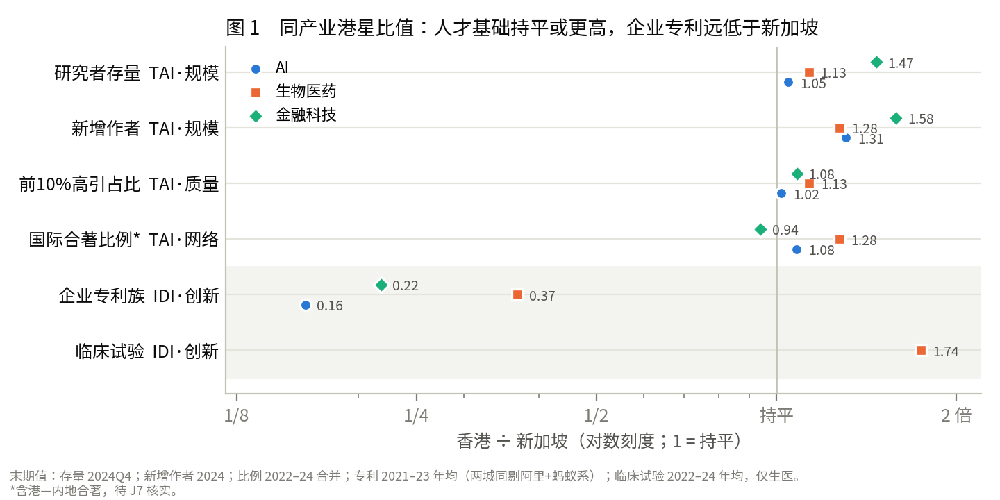

# 正文初稿 · RQ1（一）香港三产业的水平与轨迹

> **状态**：初稿，Claude 起草，待组长改。可直接并入报告「结果」章的第一节。
> **数字来源**：`scripts/rq1_levels_trajectories.py` → `clean/rq1_levels_trajectories.csv`、`logs/rq1_levels_trajectories_2026-09-29.txt`。正文每个数字都能在这两个文件里找到。
> **图**：`docs/fig/rq1_fig1_hk_sg_ratio.png`、`docs/fig/rq1_fig2_hk_sg_series.png`
> **与待拍板事项的关系**：本节只用水平、比值和单元内趋势，不依赖 γ，也不受「计数用哪种刻度」影响。研究者存量按「只用三年窗口已满的季度」计算（可用窗口，组长 2026-10-02 已定）；增长趋势按 log(x+1) 计算，与定稿刻度一致。
> **回传均已补入**：金融科技支付数据（J8，9/30）；国际合著拆分港—内地合作（J7b）、临床试验按申办方拆分（J10），10/2。

---

## 本节回答什么

提案 RQ1 的第一问是：2015–2024 年，香港三产业的人才基础与产业产出各自呈现何种水平与轨迹？第三问是：与新加坡相比处于何种相对位置？

本节只在**同一产业内**比较香港与新加坡，并描述各单元自身的时序变化，不比较不同产业之间的高低。原因见方法章：六个单元之间的差异近一半来自产业本身的学科规模（例如生物医药的论文天然远多于金融科技），跨产业比较得到的是学科常识，而不是城市特征。

---

## 一、总览：人才基础不输新加坡，企业专利明显偏少

**表 1　同产业港星比值（香港 ÷ 新加坡；大于 1 表示香港较高）**

| 维度 | 指标 | 末期口径 | AI | 生物医药 | 金融科技 |
|---|---|---|---:|---:|---:|
| TAI·规模 | 研究者存量 | 2024Q4 | 1.05 | 1.13 | 1.47 |
| TAI·规模 | 新增作者 | 2024 全年 | 1.31 | 1.28 | 1.58 |
| TAI·质量 | 前 10% 高引占比 | 2022–24 | 1.02 | 1.13 | 1.08 |
| TAI·网络 | 国际合著比例（含港—内地合作） | 2022–24 | 1.08 | 1.28 | 0.94 |
| TAI·网络 | 国际合著比例（扣除只与内地合作）† | 2022–24 | 0.86 | 0.78 | 0.84 |
| IDI·创新 | 企业专利族 | 2021–23 年均 | **0.16** | **0.37** | **0.22** |
| IDI·创新 | 临床试验 | 2022–24 年均 | — | 1.74 | — |
| IDI·创新 | 其中企业申办 | 2022–24 年均 | — | 0.97 | — |

† 出自 2026-10-02 的 OpenAlex 采集（J7b），新加坡同样扣除只与内地两方合作的论文；其余论文类指标为 9/11 采集。

三点结论：

1. **人才基础**：规模与质量两个维度上，香港在三个产业都与新加坡持平或更高（比值 1.02–1.58），而且研究者存量的增长比新加坡快。网络维度上香港的跨境合作比例看起来更高，但主要来自与内地的合作；扣除只与内地合作的论文后，香港三个产业都低于新加坡（0.78–0.86）。
2. **企业专利**：香港只有新加坡的 16%–37%，增速也只有新加坡的一半（AI）到三分之一（生物医药）。临床试验是例外，香港是新加坡的 1.74 倍，但企业申办的试验与新加坡持平（0.97），领先来自大学与医院发起的试验。
3. **所以三个产业呈现同一种错配**：香港的人才基础不输新加坡，但体现为企业专利的产出明显偏少。这一格局在三个产业都成立，说明它更可能是城市层面的特征，而不是某一个产业的问题。这正是 RQ1 第二问「TAI–IDI 匹配或错配结构」的答案。

专利偏少有一部分是登记方式造成的：新加坡是许多跨国公司的亚太总部，这些公司常以新加坡实体申请专利（例如万事达亚太一家即有 145 个金融科技专利族）。因此比值不宜读成「香港的研发只有新加坡的五分之一」，但方向在三个产业一致，且香港的增速也更慢，不能完全归因于登记方式。

---

## 二、人才基础（TAI）

### 规模：香港七年内从落后变为反超

研究者存量指三年滚动窗口内、以香港（新加坡）机构署名发表论文的唯一作者数。只使用三年窗口已满的季度（2017Q4 起）。

| | 2017Q4 港/星 | 2024Q4 香港 | 2024Q4 新加坡 | 香港年化增速 | 新加坡年化增速 | 香港反超的季度 |
|---|---:|---:|---:|---:|---:|---|
| AI | 0.68 | 5,633 | 5,382 | +22.6% | +16.6% | 2024Q3 |
| 生物医药 | 0.85 | 39,612 | 34,972 | +10.0% | +5.1% | 2022Q3 |
| 金融科技 | 0.77 | 1,158 | 789 | +41.3% | +25.4% | 2022Q1 |

2017 年底，香港三个产业的研究者存量都低于新加坡（为新加坡的 68%–85%）。此后香港增长更快，三个产业先后在 2022–2024 年反超，且反超后未再落后。新增作者的对比方向相同：2024 年香港 AI、生物医药、金融科技的新增作者分别是新加坡的 1.31、1.28、1.58 倍。

⚠ 生物医药的比值要打折看：同一查询条件下，香港生物医药的论文数在 2026 年 8 月 26 日至 9 月 11 日两次采集之间被 OpenAlex 回溯上调了约 22%（新加坡不变，见 STATUS.md「一个曾未解释的差异」）。2026 年 9 月 30 日同一查询又回落到接近 8 月 26 日的水平（以 2015 年第一季度为例：8/26 为 1,444 篇，9/11 为 1,692 篇，9/28 为 1,726 篇，9/30 为 1,440 篇），OpenAlex 似在两个数据版本之间切换。本节使用的是 9 月 11 日的数据；哪一版更接近事实目前无法判断。10 月 2 日的采集（J7b）显示，版本差异在单元之间并不均匀：同一过滤条件下 2015–2024 年全部论文，香港生物医药比 9/11 少 18%、新加坡少 4%；香港 AI 多 25%、新加坡多 19%。因此本节的论文类比值只能读作「9/11 版本下的结果」。国际合著比例受影响较小（香港生物医药 2022–24：9/11 为 86.7%，10/2 为 82.0%；港/星比值 1.28 与 1.26）。

### 质量：香港略高，且没有像新加坡那样下滑

前 10% 高引占比（按领域、年份归一化后进入全球前 10% 的论文所占比例），期初、期末各取三年合并计算：

| | 香港 2015–17 | 香港 2022–24 | 新加坡 2015–17 | 新加坡 2022–24 |
|---|---:|---:|---:|---:|
| AI | 40.3% | 36.3%（−3.9） | 43.3% | 35.6%（−7.6） |
| 生物医药 | 27.2% | 31.2%（+4.0） | 29.0% | 27.5%（−1.5） |
| 金融科技 | 49.0% | 48.5%（−0.5） | 52.5% | 44.8%（−7.8） |

括号内为变化（百分点）。期初香港三个产业都略低于新加坡，期末都略高：新加坡三个产业都在下滑，香港 AI 小幅下滑、生物医药上升、金融科技持平。辅口径顶刊份额（只有 AI 与生物医药）香港略低于新加坡（比值 0.93、0.83）。两个口径合起来看，港星在质量维上大致相当，不宜解读为香港明显领先。

### 网络：跨境合作比例更高，但主要是与内地的合作

| | 香港 2015–17 | 香港 2022–24 | 新加坡 2015–17 | 新加坡 2022–24 |
|---|---:|---:|---:|---:|
| AI | 72.2% | 80.5% | 66.3% | 74.5% |
| 生物医药 | 80.1% | 86.7% | 59.7% | 68.0% |
| 金融科技 | 72.5% | 70.9% | 52.5% | 75.4% |

AI 与生物医药两城都上升了约 7–8 个百分点，香港始终较高；生物医药的差距最大（约 19 个百分点）。金融科技论文少，比例波动大，不作解读。

但这一口径按作者机构的国家代码判断，香港（HK）与内地（CN）分属两个代码，港—内地合著也被计为国际合著。10 月 2 日按同一方法重新逐篇采集（J7b），把合作方拆开：

| 2022–24 | 香港：跨境合作中有内地参与 | 香港：只有港、内地两方 | 新加坡：有内地参与 | 新加坡：只有星、内地两方 |
|---|---:|---:|---:|---:|
| AI | 76.6% | 49.2% | 60.1% | 35.5% |
| 生物医药 | 75.3% | 44.6% | 28.1% | 10.3% |
| 金融科技 | 59.6% | 31.6% | 39.6% | 19.7% |

香港生物医药的跨境合作论文中，四分之三有内地机构参与，近一半只有港、内地两方；新加坡相应只有 28% 和 10%。两城按同一规则扣除「只与内地两方合作」的论文后：

| 2022–24 | 香港 | 新加坡 | 港／星 |
|---|---:|---:|---:|
| AI | 40.9% | 47.5% | 0.86 |
| 生物医药 | 45.4% | 58.5% | 0.78 |
| 金融科技 | 48.2% | 57.6% | 0.84 |

扣除后香港三个产业都低于新加坡。按预先写定的判读规则（`scripts/m7_cn_sensitivity.py` 文件头：扣除后香港生物医药的城市特异效应若降到 +0.10 以下，即改写结论），该效应由 +0.29 变为 −0.19（水平刻度；arcsin√p 刻度 +0.23 → −0.15），**结论应写作「香港生物医药与内地联系紧密」，而不是「国际网络更强」**。只扣香港、不扣新加坡的对照口径下，该效应约为 +0.04，同样不支持「国际网络更强」。详见 `logs/m7_cn_sensitivity_2026-10-02.txt`。

---

## 三、产业产出（IDI）

### 创新：企业专利只有新加坡的 16%–37%，且增速更慢

企业专利族按申请人所在地归属，窗口 2015–2023（受 18 个月公开滞后限制），两城同时剔除阿里巴巴与蚂蚁集团系主体。

| | 香港 2015–17 年均 | 香港 2021–23 年均 | 新加坡 2015–17 年均 | 新加坡 2021–23 年均 | 香港年化趋势 | 新加坡年化趋势 |
|---|---:|---:|---:|---:|---:|---:|
| AI | 31.7 | 50.0 | 120.0 | 307.0 | +7.5% | +15.3% |
| 生物医药 | 107.0 | 136.7 | 167.0 | 370.7 | +4.1% | +13.1% |
| 金融科技 | 13.0 | 9.7 | 71.0 | 44.3 | −3.9% | −7.9% |

AI 与生物医药的企业专利在两城都增长，但新加坡的增速约为香港的两到三倍，差距在扩大。金融科技的专利在两城都少且都在减少；这是行业特性（金融科技的创新多为软件与业务流程，较难获得专利），不作为金融科技产出的结论（见 `docs/金融科技产出口径_2026-09-29.md`）。

不剔除阿里巴巴时，香港 AI 的专利趋势为 −6.3%（剔除后 +7.5%）：阿里巴巴在港财资中心 2019 年前以其名义申请了大量专利，2020 年起改由其他主体申请。这说明「按申请人所在地」归属的专利数据对单一企业的登记安排很敏感，因此以剔除后的序列为准。

### 创新：临床试验是唯一香港领先的产出指标（仅生物医药）

| | 2015–17 年均 | 2022–24 年均 | 年化趋势 | 其中 Phase 3，2022–24 年均 |
|---|---:|---:|---:|---:|
| 香港 | 208.3 | 407.0 | +10.4% | 59.3 |
| 新加坡 | 187.3 | 233.3 | +3.7% | 50.3 |

香港新登记的临床试验在十年间接近翻倍，2022–24 年是新加坡的 1.74 倍；接近上市阶段的 Phase 3 试验为 1.18 倍。按申办方拆分（J10），**企业申办的试验香港年均 88 项、新加坡 91 项，比值 0.97**：香港的领先几乎全部来自大学、医院等非企业申办的试验（企业申办占全部试验的比例，香港约 22%，新加坡约 39%）。临床试验按试验地点计数，多国多中心试验会同时计入两城；地点字段也会被申办方事后追加，历史季度计数会缓慢上涨（见 `docs/ClinicalTrials计数漂移_2026-09-27.md`）。

### 金融科技：牌照与支付数字化（背景证据）

香港虚拟银行、储值支付、虚拟资产平台等牌照的累计数：2017 年底 13 个，2019 年底 23 个，2024 年底 31 个。新加坡没有可比的公开序列。

港星对称的只有国际清算银行（BIS）的零售支付统计，由两地金管局按同一口径报送。以快速支付（香港 FPS、新加坡 FAST，账户之间的即时转账）的人均笔数看：

| | 2018 | 2019 | 2020 | 2021 | 2022 | 2023 | 2024 |
|---|---:|---:|---:|---:|---:|---:|---:|
| 香港（笔／人） | 0.7 | 5.9 | 18.5 | 35.6 | 53.3 | 70.4 | 95.2 |
| 新加坡（笔／人） | 10.6 | 16.4 | 25.9 | 41.4 | 51.8 | 64.3 | 82.8 |
| 港／星 | 0.07 | 0.36 | 0.71 | 0.86 | 1.03 | 1.10 | 1.15 |

香港 FPS 2018 年 9 月才上线，比新加坡晚三四年，但 2022 年人均笔数追平、2024 年高出 15%。这是金融科技一格中唯一两城对称、方向明确的产出证据。它衡量的是支付被用起来的程度，不是金融科技企业的产出，且只有 2018 年以后七年，因此只作年度背景对比，不进季度分析。电子货币（储值卡、电子钱包）的笔数以交通卡为主，2020 年起两城走势受疫情和公交支付方式影响而分化，不作比较。

### 商业与资本维：无可用数据

提案中的商业维（在港实质运营公司数、18A/18C 上市）与资本维（创投融资额）在当前数据条件下均无可用的港星对称序列：InvestHK 只有全港初创公司总数、不分产业；18A/18C 上市的 70 家公司中只有 1 家在港有实质研发，已退出产出指标；创投融资额需付费数据库。因此本节的产业产出只覆盖创新维。

---

## 四、分产业小结

**人工智能。** 错配最明显。研究者存量 2024 年反超新加坡，增速更快，质量略高；跨境合作中近一半只与内地合作，扣除后低于新加坡。企业专利只有新加坡的约六分之一，增速约为新加坡的一半。

**生物医药。** 研究与临床两端都活跃：研究者存量略高于新加坡，高引占比上升且高于新加坡，临床试验是新加坡的 1.7 倍并在加速增长，但企业申办的试验与新加坡持平。企业专利只有新加坡的 0.37 倍，增速约为新加坡的三分之一。跨境合作以与内地合作为主。即「学术研究与医院临床活跃，企业端偏弱」。需要注意，企业专利只是产业化的一个侧面，这一结果不等于「商业化程度低」。

**金融科技。** 结论最弱。论文口径下香港研究者多于新加坡（1.47 倍），但金融科技以关键词界定、论文量小；专利在两城都少且都在下降；牌照只有香港有；支付数字化方面香港起步晚但 2022 年起人均快速支付笔数超过新加坡。公开数据对金融科技的覆盖在三个产业中最弱，这一点本身应在报告中说明。

---

## 五、本节须在正文中交代的限制

1. **只比同产业港星。** 不同产业之间的高低主要反映学科规模，不作比较。
2. **专利按申请人所在地归属。** 新加坡有较多跨国公司的区域知识产权实体；香港已剔除阿里巴巴在港财资中心。比值读作方向，不读作研发量之比。
3. **国际合著含港—内地合作**：按机构国家代码，港—内地合著被计为国际合著；扣除只与内地合作的论文后香港低于新加坡（见网络一节）。正文应同时报告两种口径。
4. **研究者只覆盖发表论文的人**，企业研发人员中不发表论文者不在其中；三年窗口未满的前 11 个季度已剔除。
5. **数据是快照。** 论文取自 2026-09-11 的 OpenAlex，专利取自 2026-08-27 的 Google Patents 公共数据集，临床试验取自 2026-09-25。数据源会回溯修改：香港生物医药论文在两次采集间上调约 22%；同一查询 2026-09-28 与 09-30 又相差约 17%。本文一律以 2026-09-11 的采集为准。支付数据取自 2026-09-30 的 BIS。
6. **金融科技口径最弱**，见上文。

---

## 附：数字索引

| 正文位置 | 来源（`clean/rq1_levels_trajectories.csv` 中的 indicator / metric） |
|---|---|
| 表 1 | `*` / `ratio_*`（city = hk/sg） |
| 规模表 | `m1_stock` / `level_2024Q4`、`trend_ann`；`m1_flow` / `level_2024`；反超季度与 2017Q4 比值由 `clean/researchers_stock_by_quarter.csv` 直接读取 |
| 质量表 | `m4` / `share_2015_17`、`share_2022_24`、`change_pp`；`m5` / `ratio_share_2022_24` |
| 网络表 | `m7` / 同上 |
| 专利表 | `m8` / `annual_2015_17`、`annual_2021_23`、`trend_ann`；`m8_asis` / `trend_ann` |
| 临床试验表 | `m9_trials`、`m9_phase3` |
| 牌照 | `licenses` / `cumulative_*` |
